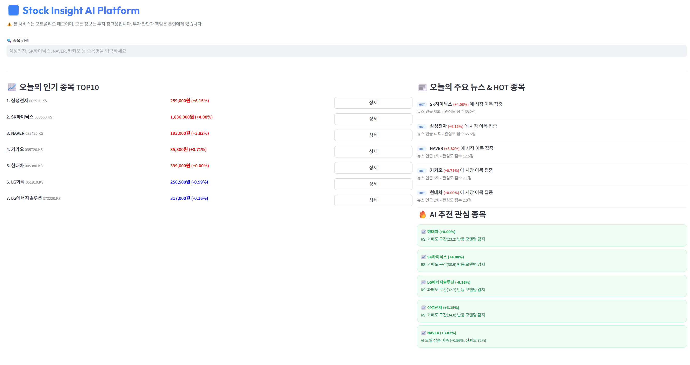
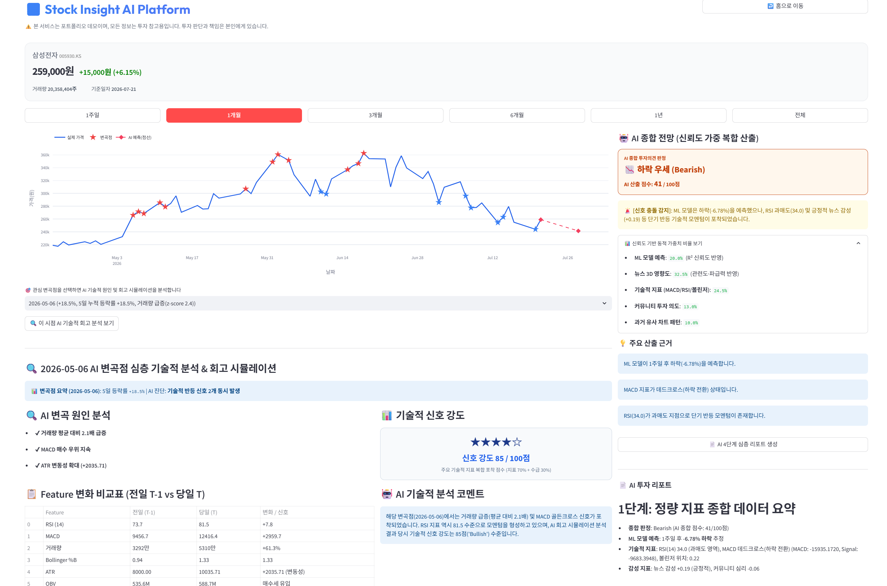
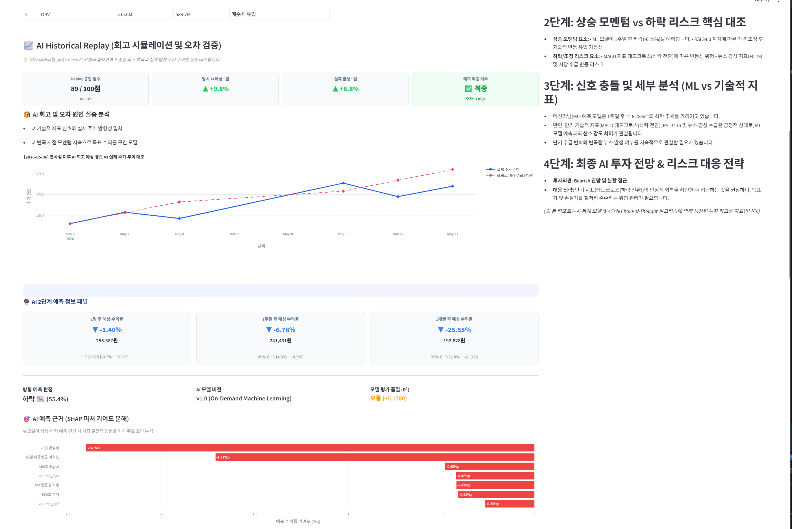
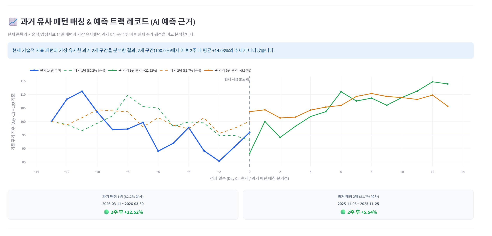
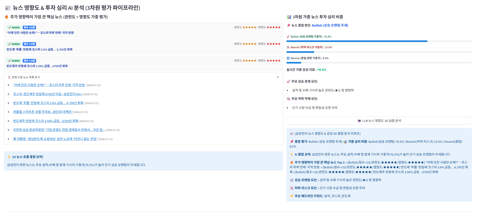
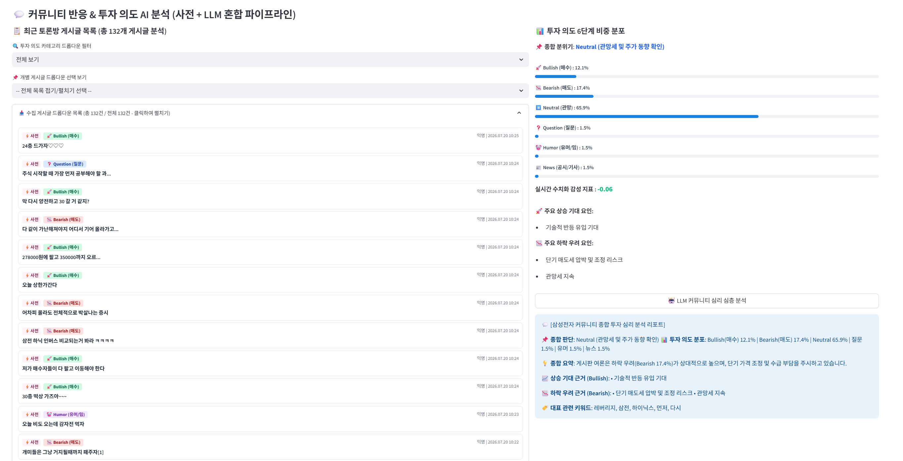

# Stock Insight AI Platform (Portfolio Project)

AI 기반 주식 종합 분석 및 시계열 머신러닝 예측 플랫폼입니다.

사용자는 종목을 검색하면 주가 차트, 변곡점(급등락) 자동 탐지, 뉴스·커뮤니티 여론 수집 및 LLM 종합 감성 분석, 머신러닝(RandomForest) 기반 주가 방향 예측, Historical Replay를 통한 과거 예측 성능 실증 검증까지 하나의 종합 대시보드에서 온디맨드(On-demand)로 확인할 수 있습니다.

> ⚠️ **Disclaimer**: 본 프로젝트는 교육 및 포트폴리오 목적으로 제작되었으며, 실제 투자 자문이나 금융 권유 서비스를 제공하지 않습니다.

---

## 📸 Platform Overview (시연 스크린샷)


<p align="center">
  <br>
  <em>[메인 홈 화면 : 주식 목록 표기]</em>
</p>

<p align="center">
  
  <br>
  <em>[좌: 해당 종목 주가 그래프 | 우:Historical Replay 오차 검증]</em>
</p>

<p align="center">
  <br>
  <em>[과거 유사 패턴 매칭]</em>
</p>

<p align="center">
  
  <br>
  <em>[좌: 뉴스 분석 | 우: 커뮤니티 분석]</em>
</p>

---

## 🌟 주요 기능 (Key Features)

- **🔍 On-demand 종목 검색 & 차트 조회**: KOSPI / KOSDAQ 전 종목 검색 및 기간별(1일~전체) 동적 주가/거래량 Plotly 차트 표출
- **⚡ 변곡점(급등락) 자동 탐지**: 5일 누적 등락률 ±10% 이상 및 거래량 급증(z-score ≥ 2.0) 기반 기술적 변곡점 자동 포착 및 이벤트 마커 시각화
- **📰 뉴스 3차원 영향도 분석**: 네이버 최신 뉴스 온디맨드 수집 및 로컬 LLM(Ollama) 기반 핵심 요약, 호재/악재 분류, 3차원 주가 영향도 평가
- **💬 커뮤니티 투자 심리 6대 분류**: 종목별 네이버 증권 종목토론방 게시글 자동 수집 및 LLM 기반 6대 인텐트(`Bullish`, `Bearish`, `Neutral`, `Question`, `News`, `Humor`) 분류, 핵심 이슈 요약
- **🤖 2단계 머신러닝 주가 방향 예측**: OHLCV, 기술적 지표, 거시경제 및 감성 지표 기반 RandomForest 1일/1주일/1개월 향후 주가 수치 및 방향 예측
- **📐 연속적 R² 신뢰도 캘리브레이션**: 회고 평가 R² 점수 및 Decision Tree Ensemble Voting Consensus 기반 연속적 신뢰도 보정 수식을 통해 예측 불확실성 조율
- **🎯 SHAP 피처 기여도 해설 및 시각화**: SHAP(SHapley Additive exPlanations) 값을 통한 모델 상승/하락 예측 판단 시 주요 지표별 기여도 수치화 및 Plotly 바 차트 시각화
- **📈 Historical Replay (회고 시뮬레이션 및 오차 검증)**: 과거 변곡 시점 당시 데이터를 기반으로 현재 AI 모델 예측을 재현하고, 실제 5일 발생 주가 추이와 실증 대조하여 적중 여부(`✅/❌`) 및 미적중 원인 분석 제시
- **💡 LLM 기반 단계적 투자 분석 보고서**: 뉴스, 커뮤니티, 기술적 지표, 머신러닝 예측을 통합한 단계적 분석 리포트 및 AI 종합 투자 의견(매수/관망/매도) 생성

---

## 🛠 Tech Stack

| 구분 | 기술 스택 | 설명 |
| :--- | :--- | :--- |
| **Frontend** | Streamlit, Plotly, HTML5/CSS3 | 대화형 프론트엔드 대시보드 및 동적 차트 시각화 |
| **Backend** | FastAPI, Python 3.11, Pydantic, SQLAlchemy | On-demand RESTful API 서빙 및 캐싱 |
| **AI / ML** | Ollama (Qwen2.5:7b / Llama3.2), RandomForest (Scikit-Learn), SHAP | LLM 요약/감성분석, 회귀/분류 예측, SHAP 피처 해설 |
| **Database** | MySQL 8.0 | 사용자 조회 및 예측 이력 저장 |
| **MLOps** | Airflow, Spark 3.5, MLflow, MinIO | Airflow 정기 데이터 수집, Spark Feature Engineering, MLflow 모델 버저닝, MinIO Artifact 저장 |
| **Monitoring** | Prometheus, Grafana | 배치 DAG 성공률 및 API 시스템 메트릭 모니터링 |
| **Infrastructure**| Docker, Docker Compose | 전체 11개 컨테이너 서비스 오케스트레이션 |

---

## 🏗 System Architecture & Internal Pipeline

### 1. 시스템 아키텍처 (Architecture)

```text
                                [ 사용자 ]
                                    │
                                    ▼
                         Streamlit Frontend (8501)
                                    │
                                    ▼
                         FastAPI Backend (8000)
                                    │
  ┌───────────────┬─────────────────┼─────────────────┬────────────────┐
  │               │                 │                 │                │
  ▼               ▼                 ▼                 ▼                ▼
yfinance      changepoint      news_service      community_service   predict_service
(주가/지표)  (변곡점 탐지)     (뉴스 수집)       (토론방 크롤링)     (RF/SHAP 예측)
                                    │                 │                │
                                    └────────┬────────┘                │
                                             ▼                         │
                                      llm_service                      │
                                   (Ollama Qwen 2.5)                   │
                                             │                         │
  ───────────────────────────────────────────┴─────────────────────────┴────────────
  [MLOps 파이프라인] Airflow (8081) ──> Spark ──> MLflow (5000) ──> MinIO (9001) / MySQL
```

### 2. predict_service 내부 실행 순서 (Prediction Pipeline Sequence)

```text
  [입력 데이터 (43개 Feature)]
               │
               ▼
   RandomForest Regression 예측  ──>  Tree Voting Consensus (부호 일치율) 계산
               │                                      │
               ▼                                      ▼
   SHAP Attribution 계산 (피처 기여도)   Continuous R² Calibration (신뢰도 조율)
               │                                      │
               └──────────────────┬───────────────────┘
                                  ▼
                     Final Direction Confidence
```

### 3. 처리 흐름 (Data Flow)

```text
사용자 종목 검색 요청 (On-demand)
    │
    ▼
주가 데이터 수집 (yfinance API) & 기술적 지표 산출
    │
    ▼
변곡점 자동 탐지 (5일 누적 등락률 ±10% / 거래량 Z-Score ≥ 2.0)
    │
    ├─────────────────────────────┐
    ▼                             ▼
뉴스 수집 (네이버 API)         커뮤니티 수집 (네이버 증권 토론방)
    │                             │
    └──────────────┬──────────────┘
                   ▼
       LLM 요약 및 6대 인텐트 감성 분류 (Ollama)
                   │
                   ▼
      기술적 + 감성 43개 Feature 생성
                   │
                   ▼
   RandomForest 회귀 예측 & Tree Consensus 계산
                   │
                   ▼
   연속적 R² 캘리브레이션 적용 (Final Confidence 산출)
                   │
                   ▼
   Historical Replay 시뮬레이션 & 오차 실증 분석
                   │
                   ▼
   LLM 기반 단계적 투자 분석 보고서 출력
```

---

## 🤖 AI & LLM 분석 파이프라인

### 📰 뉴스 분석 (News Pipeline)
- 네이버 뉴스 API를 통해 직근 3일간의 종목 뉴스 온디맨드 수집
- LLM을 통해 핵심 헤드라인 3줄 요약, 긍정/부정/중립 감성 점수 산출 및 3차원 주가 영향도 평가

### 💬 커뮤니티 분석 (Community Pipeline)
- 종목별 커뮤니티(네이버 증권 종목토론방) 최신 게시글 100~300건 온디맨드 수집
- 1차 사전 분류 + 2차 LLM 6대 인텐트 분류(`Bullish`, `Bearish`, `Neutral`, `Question`, `News`, `Humor`)를 거쳐 여론 비중 집계 및 핵심 이슈 요약 생성

### 💡 LLM 기반 단계적 투자 분석 보고서 (Investment Decision Report)
- 뉴스 감성, 커뮤니티 여론, 기술적 지표(MACD, RSI, BB), 머신러닝 주가 방향 예측 결과를 종합 가중 평가하여 **매수(BUY)**, **관망(HOLD)**, **매도(SELL)** 단계적 리포트 생성

---

## 📈 Historical Replay (회고 시뮬레이션 및 오차 검증)

과거 변곡 시점을 선택하면 당시 수집 데이터 및 기술 지표를 바탕으로 AI 모델의 회고 예측을 재현하고, 실제 발생한 주가 추이와 실증 대조합니다.

```text
📈 AI Historical Replay (회고 시뮬레이션 및 오차 검증)

[ Replay 종합 점수 ]   [ 당시 AI 예상 5일 ]   [ 실제 발생 5일 ]   [ 예측 적중 여부 ]
   96 / 100점               ▲ +11.5%             ▼ -7.5%          ❌ 미적중
    Neutral                                                     오차: 19.0%p

🧐 AI 회고 및 오차 원인 실증 분석
 - ✔ 변곡 당일 기술적 지표 신호(거래량/크로스) 포착
 - ✖ 변곡 직후 외국인·기관 수급 이탈 및 매크로 시장 조정 발생
```

- **제공 정보**:
  - `Technical Signal Score`: 기술적 지표 포착 점수 (100점 만점)
  - `Replay Evaluation`: 당시 AI 예상 5일 수익률 vs 실제 발생 5일 수익률
  - `예측 적중 여부`: 방향 일치 시 `✅ 적중`, 불일치 시 `❌ 미적중 (오차 %p)`
  - `AI 오차 원인 실증 분석`: 미적중 시 당시 외생 변수 및 수급 변경 사유 해설

---

## 🧠 머신러닝 & 연속적 R² 신뢰도 보정

### 1. Feature 스펙 (총 43개 정량·정성 Feature)
- **주가/거래량 (17개)**: OHLCV, 일일/5일/20일 수익률, 이동평균 이격도(MA5/20/60), 변동성, 거래량 비율/변화율, Lag 지표
- **기술적 지표 (8개)**: RSI(14), MACD, MACD Signal, MACD Hist, Bollinger %B, Bollinger Upper/Lower Gap, ATR(14), Volume Z-Score
- **거시경제 & 수급 (9개)**: KOSPI 수익률/이격도, KOSDAQ 수익률, 환율(USD/KRW) 변동률/이격도, VIX Index, 시장 거래대금 변화율
- **정성 감성 지표 (9개)**: 뉴스 긍부정 점수, 뉴스 3일/7일 감성 지수, 커뮤니티 3일/7일 여론 지수

### 2. 연속적 R² 신뢰도 캘리브레이션 수식 (Continuous Calibration Flow)

$$\text{Tree Consensus} = \frac{\text{방향 일치 Decision Tree 개수}}{\text{전체 Decision Tree 개수}} \times 100\%$$

$$\text{Calibration Factor}(R^2) = \max\left(0.4, \min\left(1.0, \frac{R^2 + 1.0}{2.0}\right)\right)$$

$$\text{Final Direction Confidence} = \max\left(50.0\%, \min\left(99.0\%, \text{Tree Consensus} \times \text{Calibration Factor}(R^2)\right)\right)$$

```text
Tree Consensus (Tree Voting 부호 일치율)
        │
        ▼
Continuous R² Calibration (R² 성과 연동 감쇄)
        │
        ▼
Final Direction Confidence (최종 방향 신뢰도)
```

---

## 📁 디렉토리 구조 (Directory Structure)

```text
stock-llm-pipeline/
├── docker-compose.yml              # 전체 통합 11개 컨테이너 스택 정의
├── .env.example                    # 환경변수 템플릿 (네이버 API 키 등)
├── backend/                        # ★ FastAPI 백엔드 API (On-demand 서빙)
│   ├── main.py                     # FastAPI 엔드포인트 라우팅 및 캐싱
│   ├── predict_service.py          # 머신러닝 예측, SHAP 및 R² 캘리브레이션
│   ├── news_service.py             # 네이버 뉴스 수집 & LLM 영향도 분석
│   ├── community_service.py        # 네이버 증권 토론방 수집 & 6대 인텐트 분류
│   ├── llm_service.py              # Ollama LLM 연동 헬퍼
│   ├── changepoint.py              # 변곡점 탐지 및 Historical Replay
│   ├── analyze_service.py          # LLM 기반 단계적 투자 분석 보고서 생성 Engine
│   ├── ticker_map.py               # 종목 코드 매핑
│   └── db.py                       # MySQL 데이터베이스 연동
├── streamlit_app/
│   ├── app.py                      # ★ 메인 대시보드 UI (Streamlit & Plotly)
│   └── Dockerfile.streamlit
├── dags/
│   └── stock_pipeline_dag.py       # [MLOps] Airflow 정기 데이터 수집 & 재학습 DAG
├── crawlers/                       # [MLOps] 배치 수집용 크롤러
├── spark_jobs/                     # [MLOps] Spark Feature Engineering 작업
├── mlflow_scripts/                 # [MLOps] MLflow 모델 재학습 및 레지스트리 관리
└── monitoring/                     # Prometheus & Grafana 대시보드 설정
```

---

## 🚀 시작하기 (Quick Start)

### 1. 사전 준비
- Docker Engine & Docker Compose v2 (권장 RAM 8GB 이상)
- 네이버 개발자 센터 (https://developers.naver.com) 검색 API 키 발급

### 2. 환경 변수 설정
```bash
cp .env.example .env
# .env 파일 내 NAVER_CLIENT_ID 및 NAVER_CLIENT_SECRET 입력
```

### 3. 전체 스택 실행
```bash
docker compose up -d
```

### 4. Ollama LLM 모델 다운로드 (최초 1회)
```bash
docker exec -it stock-llm-pipeline-ollama-1 ollama pull qwen2.5:7b
```

### 5. 서비스 접속 정보
- **Streamlit 메인 UI**: `http://localhost:8501`
- **FastAPI Docs**: `http://localhost:8000/docs`
- **MLflow Dashboard**: `http://localhost:5000`
- **Airflow DAG Manager**: `http://localhost:8081` (admin / admin)
- **MinIO Console**: `http://localhost:9001` (minioadmin / minioadmin)
- **Grafana Monitoring**: `http://localhost:3000` (admin / admin)

---

## 📋 요구사항 (UR) ↔ 코드 매핑표

| 요구사항 ID | 요구사항 명칭 | 구현 파일 위치 |
| :--- | :--- | :--- |
| **UR-01** | 종목 검색 | `backend/ticker_map.py`, `GET /search` |
| **UR-02/03** | 주가 차트 및 기간 조회 | `streamlit_app/app.py`, `GET /prices/{ticker}` |
| **UR-04/05** | 변곡점 자동 탐지 & 마커 | `backend/changepoint.py`, `detect_changepoints` |
| **UR-07** | 뉴스 수집 | `backend/news_service.py` |
| **UR-08/09** | LLM 뉴스 요약 & 영향도 | `backend/news_service.py`, `backend/llm_service.py` |
| **UR-10** | 머신러닝 주가 방향 예측 | `backend/predict_service.py` |
| **UR-11** | 예측 점선 시각화 | `streamlit_app/app.py` (Plotly overlay) |
| **UR-12** | 예측 근거 & SHAP 분해 시각화 | `backend/predict_service.py`, `streamlit_app/app.py` |
| **UR-13** | 커뮤니티 6대 인텐트 수집/요약 | `backend/community_service.py` |
| **UR-14** | LLM 단계적 투자 분석 보고서 | `backend/analyze_service.py` |
| **UR-15** | Historical Replay 오차 실증 검증 | `backend/changepoint.py` |
